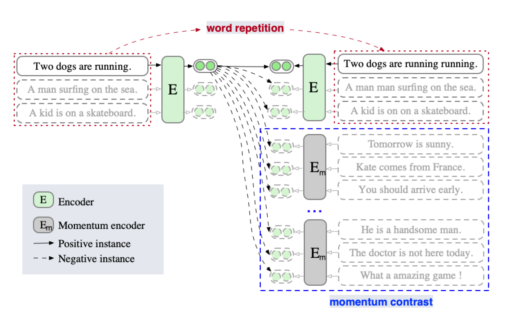
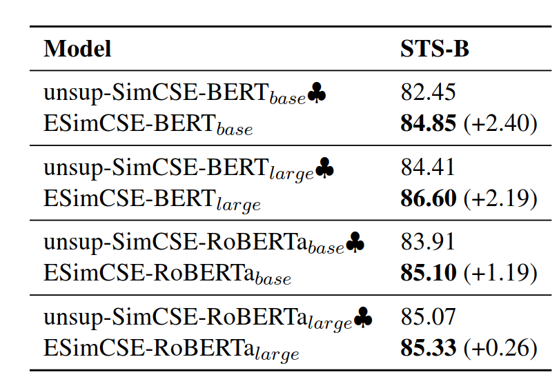
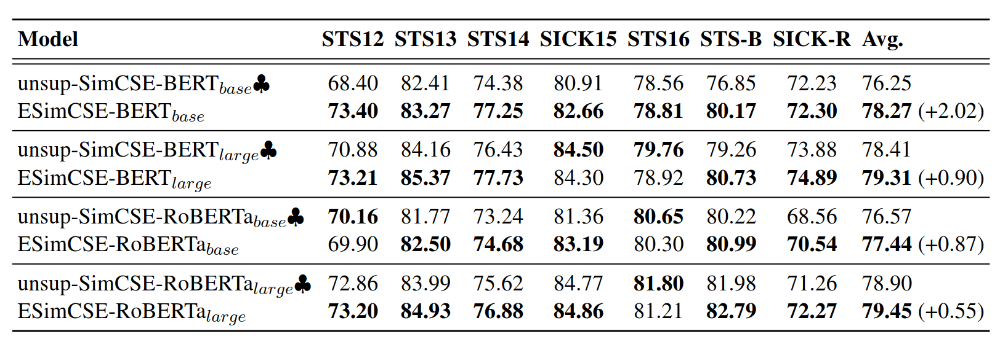
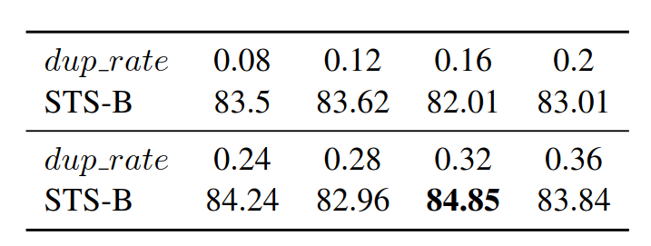
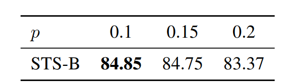
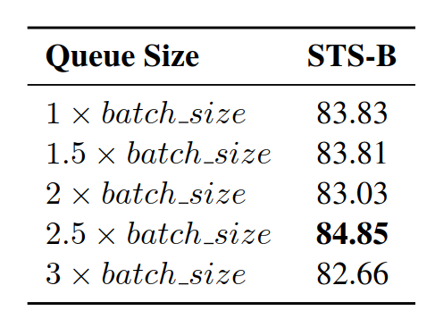

# 1. ESimCSE的设计思路
--------------------------------
ESimCSE是基于SimCSE设计的。SimCSE建立在transformer上，会把长度信息编码进句子嵌入。因此从相同句子提取的正例对包含相同的长度信息，而从不同句子提取的负例对包含不同的长度信息。正例对和负例对包含的不同长度信息可以看做是一个特征用以区分。语义模型训练时可能产生偏置，认为两个有相同长度的句子，在语义上更相似。  
ESimCSE通过对输入句子进行**词重复(Word Repetition)** 缓解这一问题的影响，并通过**动量对比(Momentum contrast)**增加负例对的数量。这两种方法都能提升模型性能，组合在一起时可以发挥更好的效果。

# 2. ESimCSE模型结构
------------------------------------------------

# 3. 具体设计
------------------------------------------------

## 3.1. Word Repetition 

通过随机复制句子里的一些词，生成更多的负例对。例如“I like this apple because it looks so fresh and I think it should be delicious.”，经过处理可以表示成“I **I** like this apple apple because it looks **looks** so fresh **fresh** and I think it should be delicious *delicious*.”
给定一个句子，经过分词处理后得到子序列，$x=\{x_1,x_2,\cdots, x_N\}$，$N$是句子的长度。定义需要重复的token长度：

$$dup\_len\in [0,max(2, int(dup_rate * N))]$$

dup_rate是表示最大重复率的超参，dup_len是上述区间里的随机值。之后通过均匀分布选择居中dup_len个数的词进行重复操作，组成dup_set集合：

$$dup\_set=uniform(range=[1,N],num=dup\_len)$$

原序列$x$就可以表示为$x^+=\{x_1,x_1,x_2,\cdots, x_N\}$

 

## 3.2. Momentum contrast 
使用一个队列存储句子嵌入的信息，当前mini-batch的句子嵌入入队，较老的句子嵌入出队。句子嵌入的信息得以重复使用。在这个过程中不进行dropout，缩小训练和预测之间的差距。
把编码器的元素记作$\theta _e$，Momentum-updated编码器的元素记作$\theta _m$，通过以下形式更新$\theta _m$：

$$\theta _m \leftarrow \lambda \theta _m +(1-\lambda) \theta _e$$

$\lambda$表示动量系数。只有$\theta _e$通过反向传播更新，$\theta _m$被用于生成句子，因为动量更新使$\theta _m$演化得比$\theta _e$更平滑。虽然队列中的嵌入是由不同编码器编码得到，这些编码器的区别很小。

最终ESimSCE的损失函数可以表示为：
$$l_i = - \log \frac{e^{sim(h_i,h_i^+)/\tau }}{\sum_{j=1}^N e^{sim(h_i,h_i^+)/\tau} + \sum_{m=1}^M e^{sim(h_i,h_m^+)/\tau}}$$

$h_m^+$表示momentum-upadated队列中的句子嵌入，$M$表示队列的size。

# 4. 实验
------------------------------------------------

在STS-B和STS 2012-2016数据集上进行文本语义相似度实验，证明了预训练模型不管是BERT还是RoBERTa，ESimCSE表现普遍优于SimCSE。实验结果如图：

# 5. 消融研究
--------------------------------

实验表明，dropout为0.1，词重复率为0.32，momentum contrast队列size为2.5倍batch size时模型性能最佳。

# 6. 参考文献：
   1. [ESimCSE:Enhanced Sample Building Method for Contrastive Learning of Unsupervised Sentence Embedding](https://arxiv.org/pdf/2109.04380.pdf)
