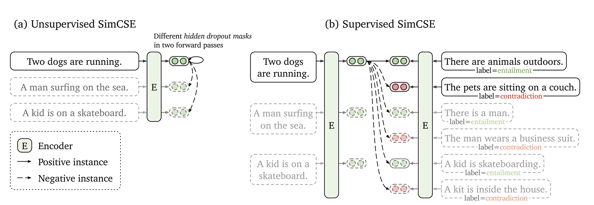
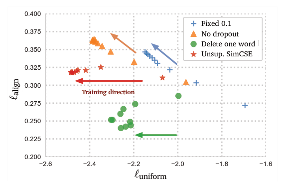
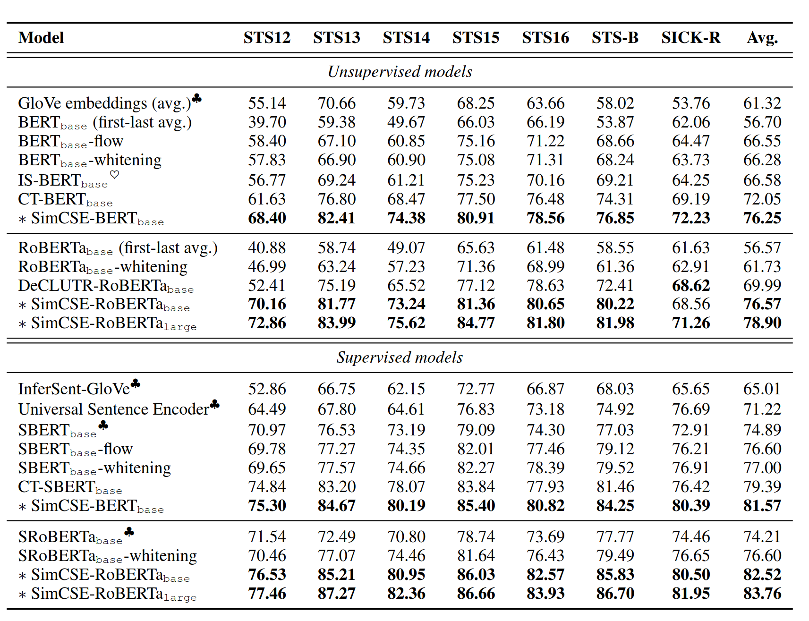
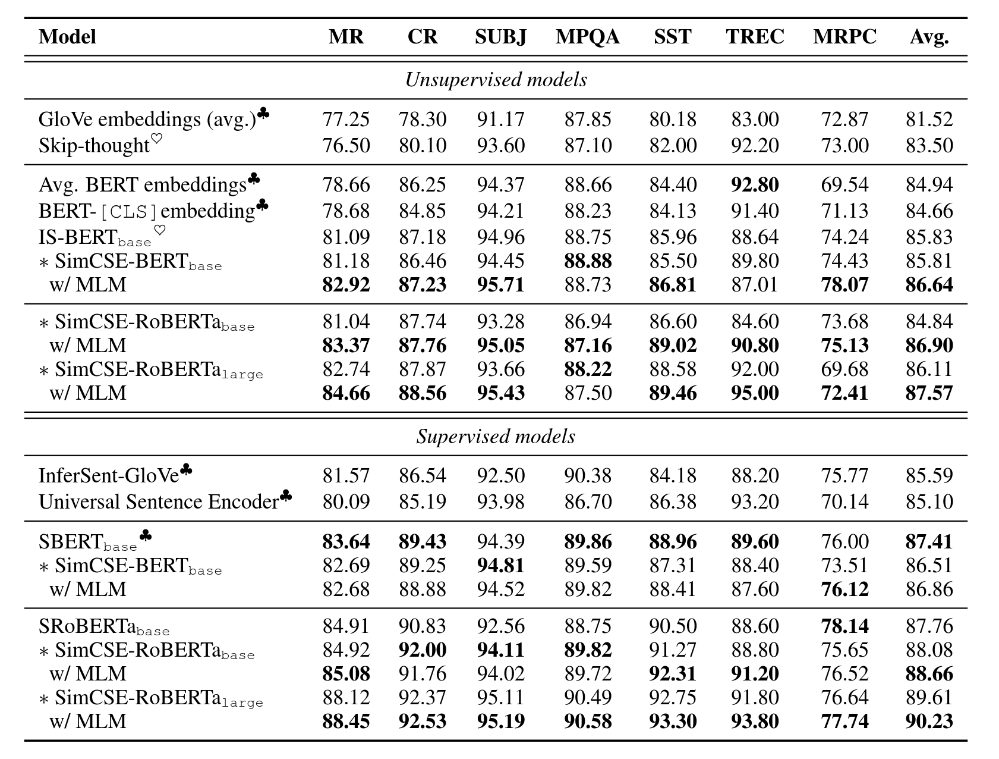

# 介绍
--------------------------------

SimCSE是对比学习模型，和BERT或者RoBERTa组合在一起时非常有效。对比学习保证了正例之间的相似和负例的疏远，良好的嵌入表示提高了模型的性能。

无监督的SimCSE，使用标准dropout，把同一句子编码两次，构成正例对，同batch的其他句子作为负例。

有监督的SimCSE，利用自然语言推断数据集(natural language inference，NLI)自带标签，entailment作为正例，contradiction作为hard negatives。

# 模型结构
--------------------------------

  

# 背景：对比学习
--------------------------------

对比学习旨在通过把语义上的近邻聚合，非近邻分离来学习有效的表示。假设有一串匹配对样例，记作$D={(x_i, x_i^{+})}_{i=1}^m$，$x_i,x_i^+$语义相关。记$h_i,h_i^+$代表$x_i,x_i^+$的分布，对于一个有N对的mini-batch来说，$(x_i, x_i^{+})$的损失函数如下,相当于多分类的softmax交叉熵损失函数：

$$l_i = -\log \frac{e^\frac{sim(h_i,h_i^+)}{\tau}}{\sum_{j=1}^{N}e^\frac{sim(h_i,h_j^+)}{\tau}} \tag1$$

${\tau}$是温度系数，$sim(h_1,h_2)=\frac{h_1^Th_2}{||h_1||\cdot ||h_2||}$。使用例如BERT或者RoBERTa的预训练语言模型对输入句子编码：$h=f_{\theta}(x)$，然后通过等式(1)微调所有参数。

## 无监督的SimCSE
------------------------------------------------

为了构建$(x_i, x_i^{+})$正例对，可以对原文本进行裁剪、重排序、词替换等方式的数据增强，实验表明dropout是最优的。在训练中池化方式采用[CLS]可以取得最好效果。loss可以表示为：

$$l_i = -\log \frac{e^\frac{sim(h_i^{z_i},h_i^{z_i^\prime })}{\tau}}{\sum_{j=1}^{N}e^\frac{sim(h_i^{z_i},h_j^{z_j^\prime })}{\tau}}$$

alignment和uniform表示对比学习句子表示的质量。
给定一个正例对$p_{pos}$的分布，alignment表示句子嵌入之间的预期距离，uniform衡量嵌入均匀分布的程度，$p_{data}$代表数据分布：

$$l_{align}\triangleq \underset{(x,x^+) \backsim pos}{\mathbb{E}}||f(x)-f(x^+)||^2 $$

$$l_{uniform} \triangleq {\underset{x,y \backsim p_{data}}{\underset{i.i.d}{\mathbb{E}}}} e^{-2||f(x)-f(y)||^2} $$

可见无监督SimCSE在保证align稳定的同时，也具有良好的uniform。  

# 有监督SimCSE
--------------------------------

利用NLI数据集，entailment作为正例，contradiction为hard positives。拓展$(x_i, x_i^{+})$为$(x_i, x_i^{+},x_i^{-})$，分别代表假设、entailment和contradiction。池化方式对模型性能无明显影响。loss表示为：

$$l_i = -\log \frac{e^\frac{sim(h_i,h_i^+)}{\tau}}{\sum_{j=1}^{N}(e^\frac{sim(h_i,h_j^+)}{\tau}  + e^\frac{sim(h_i,h_j^-)}{\tau} )}$$

# 实验
--------------------------------
- 语义相似度实验
  
SimCSE超越了当时的众多方法，并且比部分监督学习表现得更好。

- 迁移实验  
    
SunCSE没有取得非常好的效果，说明迁移学习任务并不能从均匀的句子表征多多收益，迁移学习不是句子嵌入的主要目标。

# 参考文献
1. [SimCSE:Simple Contrastive Learning of Sententce Embeddings](https://arxiv.org/pdf/2104.08821.pdf)
